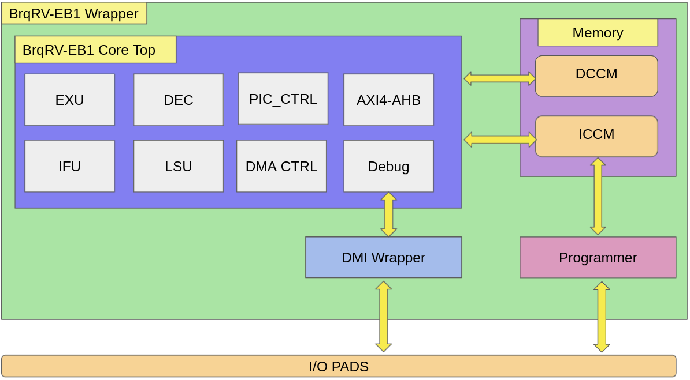

  

# BrqRV EB1 RISC-V Core 1.0 from MERL

This repository contains the BrqRV EB1 Core design RTL. BrqRV EB1 Is A Machine-Mode (M-Mode) Only, 32-Bit Cpu Small Core Which Supports Risc-V’s Integer (I), Compressed Instruction (C), Multiplication And Division (M), And Instruction-Fetch Fence, And Csr Extensions. The Core Contains A 4-Stage, Scalar, In-Order Pipeline

## Block Diagram

## Directory Structure

    ├── verlog                          #   User verilog Directory
    │   ├── rtl                         #   RTL
    │   ├── dv                          #   Design Verification
    │   ├── gl                          #   Gate Level Netlis
    
   #  The BrqRV_EB1 Source Code is avaialable here
    
    ├── verlog                               #   User verilog Directory
    │   ├── rtl                              #   RTL
    |       ├── user_project_wrapper.v       #   User Project Wrapper source file
    |       ├── user_proj_example.v          #   User Project Example source file
    |       ├── Brqrv_EB1                    #   BrqRV_EB1 folder
    |           ├── Brqrv_EB1.v                                     #   BrqRV_EB1 source file
    |           ├── sky130_sram_1kbyte_1rw1r_32x256_8.v             #   1KB sram
    
    
   # The Design Verification Testbench is available here 
    ├── verlog                               #   User verilog Directory
    │   ├── dv                               #   Design Verification
    │       ├── BrqRV_EB1                    #   Design Test Directory
    │       ├── hex                          #   Hex files folder
    │       ├── asm                          #   Assmebly files folder
     
  # The synthesized netlist is present here:
  
    ├── verlog                               #   User verilog Directory
    │   ├── gl                               #   Gate Level Netlis
    │       ├── user_project_wrapper.v       #   User Project Wrapper Netlist
    │       ├── user_proj_example.v          #   User Project Example Netlist
    
 # The hardened macros are placed here:

    ├── def                                 #    def Directory
    │   ├── user_project_wrapper.def        #    User Project Wrapper def file
    
    ├── lef                                 #    lef Directory
    │   ├── user_project_wrapper.lef        #    User Project Wrapper lef file
    │   ├── user_proj_example.lef           #    User Project Example lef file
    
    ├── gds                                 #    gds Directory
    │   ├── user_project_wrapper.gdz.gz     #    User Project Wrapper gds
    │   ├── user_proj_example.gdz.gz        #    User Project Example gds

### Testing of Design

Go to verilog/dv/BrqRV_EB1/ directory

1. Set the GCC_PATH environment variable.
2. Set the PDK_PATH environment variable.
3. Copy the given program hex file into uart.hex. 
4. run the make commad for RTL simulation
5. run the SIM=GL make command for netlist simulation

Note: Dont forget to add 00000FFF instruction in the end of the uart.hex to stop the uart transmission if you are using your own codes.
